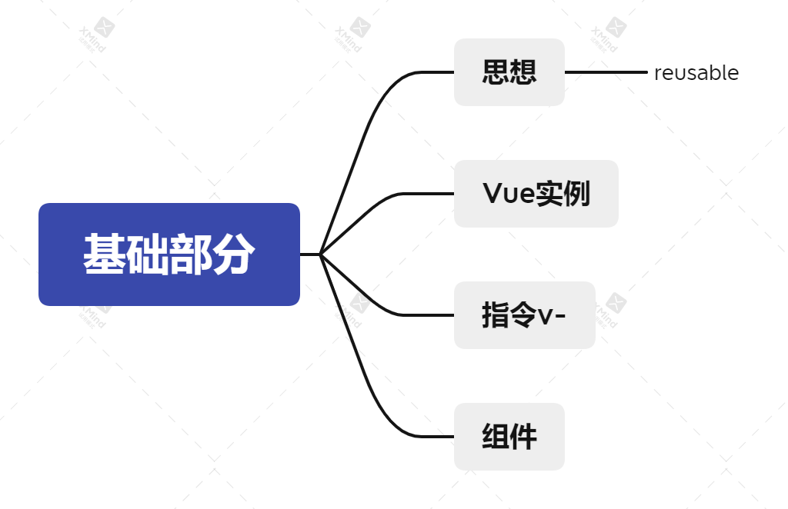

# vue基础，希望我尽早学会吧

## 思想
本篇中，我体会到了作者的reusable思想
尤其是在介绍v-if这一节中，作者用切换登录方式的例子告诉我们，因为采取reusable的策略，所以会出现input元素重复利用，所以需要加入key attribute来解决

## 创建Vue实例
通过new Vue({
    el: '#app'
})
的方式，创建根元素/vue实例。个人理解有种像局部作用域的感觉，在其中可以用到data、methods等中的属性

### 插值
将插入内容放置在data中：
```js
new Vue({
    el: '#app',
    data: {
        text: 'hello'
    }
})
```

text： {{ text }} 采用此种方式，将文本插入到相应位置
非text：   不需要{{ }}
```html
<div id='app'>
    <h3>
        {{ text }}
    </h3>
</div>
```


### 可计算属性
在computed中，写入相应可计算属性，其为一个fuction,其他内容同上述的插值，只是值为动态
```js
new Vue({
    el: '#app',
    data: {
        text: 'hello'
    },
    computed: {
        helloText: function() {
            return 'hello' + this.text
        }
    }
})
```


## 指令v-
v-bind绑定元素
```html
<div v-bind:href="url"></div>
```

v-on监听事件
```html
<div v-on:click="doSomething"></div>
```

v-if判断条件，true可以显示
```html
<div v-if="seen"></div>
```

v-for循环
```html
<div v-for="set in sets"></div>//set为循环sets中的每一项
```

v-model表单输入绑定
```html
<p>{{text}}</p>
<input v-model="text">
```


## 组件
```html
<blog-set>
</blog-set>
```

```js
Vue.component('blog-set', {
    templated: `<div>hello world {{title}}</div>`,
    props: ['title']
})
```

props是在组件上自定义的属性，值传递给props中的attribute，然后能够在组件实例中访问这个值，就像访问 data 中的值一样

## 实践
官方文档让我们休息一下，做个小demo复习
1. 基础部分最后给了个动态切换组件
2. 官方网站中实例部分第一个Markdown编辑器

准备下一阶段了

